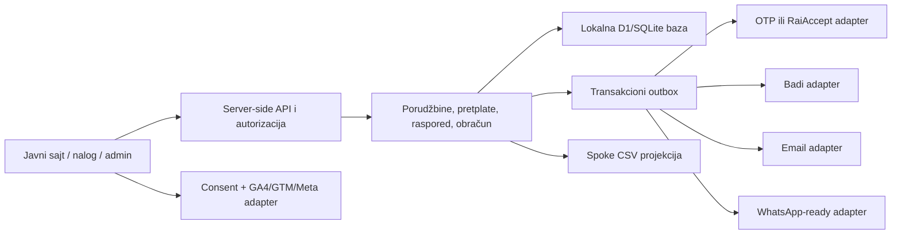

# Mleko i Mleko - lokalna MVP arhitektura

Ovaj dokument prevodi poslovni brif u stabilne backend granice. Trenutni cilj je
potpuno lokalna aplikacija. Nijedna integracija ne sme da poziva produkciju bez
izričitog izbora provajdera, produkcionog moda i sigurnosnog `ALLOW_...` prekidača.

## Ključni model

Najvažnija odluka je da pretplata nije jedna dinamika za celu korpu. Svaka stavka
ima sopstveni režim:

- `one_time`: samo jedna konkretna isporuka;
- `subscription + weekly`: svake nedelje;
- `subscription + biweekly`: svake dve nedelje;
- `next_delivery_addon`: jednokratna stavka vezana za sledeću isporuku postojeće
  pretplate.

Količina, cena i poreska oznaka moraju biti snapshot-ovani na isporuci/porudžbini.
Izmena kataloga ne sme retroaktivno da promeni već formiranu obavezu ili račun.

## Granice sistema



Provajderski adapteri ne odlučuju poslovna pravila. Oni primaju kanonske komande,
prevode ih u ugovor izabranog provajdera i vraćaju kanonski rezultat. Time se OTP
može zameniti RaiAccept-om bez menjanja obračuna pretplate.

## Stanja i invariants

### Pretplata

Dozvoljena stanja: `active`, `paused`, `cancelled`. Otkazana pretplata je terminalna;
ponovno korišćenje zahteva novu pretplatu. Pauza ima `pausedUntil`, a nastavak briše
to polje i ponovo projektuje buduće isporuke.

Svaka mutacija mora:

1. proveriti vlasništvo ili admin ulogu;
2. proveriti verziju zapisa (optimistic concurrency);
3. izračunati da li je rok istekao;
4. ažurirati poslovni zapis i upisati audit/outbox u istoj DB transakciji;
5. vratiti novu verziju i sledeću isporuku.

### Isporuka

Dozvoljena stanja: `planned`, `locked`, `skipped`, `ready`, `delivered`, `cancelled`.
Rok je `deliveryStartsAt - cutoffHours`, računa se server-side u zoni
`Europe/Belgrade`. Admin podešava `cutoffHours`; promena mora imati audit zapis.

Zaključavanje ne sme da zavisi samo od periodičnog joba: svaki write endpoint ponovo
proverava trenutni sat. Job može unapred označiti `locked`, ali vreme je autoritet.
Već zaključana isporuka se ne menja korisničkim endpointom. Admin override je posebna
akcija sa obaveznim razlogom.

### Plaćanje i mesečni obračun

Novac se čuva kao ceo broj najmanje novčane jedinice koju zahteva izabrani provajder,
uz eksplicitnu valutu `RSD`. Nikada `float`.

Mesečni obračun snapshot-uje planirane isporuke tog kalendarskog meseca. Zato mesec
može imati četiri ili pet nedeljnih termina i ne sme se računati prostim množenjem sa
četiri. Dvonedeljni termini se računaju iz anchor datuma stavke.

Posle uspešne mesečne naplate ne prepisuje se stari obračun. Izmene stvaraju
append-only ledger stavke:

- pozitivna razlika: zaduženje sledećeg obračuna ili eksplicitna dodatna naplata;
- negativna razlika: kredit koji se automatski prenosi;
- preskakanje/pauza: kredit za neisporučenu, već plaćenu stavku;
- refund: posebna transakcija povezana sa originalnom naplatom.

Tačna politika dodatne naplate/refunda mora biti odobrena od strane vlasnika i
knjigovođe pre produkcije. MVP može dosledno koristiti kredit u sledećem mesecu.

### Kartice

Aplikacija nikada ne prima niti čuva PAN, CVV/CVC ili datum isteka. Hosted payment
page ili tokenizacija banke vraća samo provider token/reference. Recurring naplata
koristi taj token i novi idempotency key za svaki mesečni obračun.

OTP i RaiAccept su različiti provajderi. Izbor je globalna konfiguracija i njihove
tajne, webhook potpisi, statusi i endpointi se nikada ne mešaju.

### Fiskalizacija

Fiskalni račun nastaje iz zaključanog snapshot-a naplate/isporuke. Svaki pokušaj ima
idempotency key, broj pokušaja i sačuvan odgovor bez tajni. Ne izdavati duplikat pri
retry-ju. Badi neuspeh ide u retry/DLQ i vidljiv je adminu; plaćanje se ne proglašava
neuspešnim samo zato što naknadna fiskalizacija privremeno ne radi.

Tačan trenutak fiskalizacije kartice, gotovine, avansa, konačnog računa i refundacije
mora potvrditi knjigovođa/poreski savetnik pre produkcije.

## Transakcioni outbox

Svi spoljni efekti su asinhroni. U istoj transakciji sa domenom upisuje se outbox
poruka: `eventType`, `aggregateId`, `idempotencyKey`, payload, `attempts`,
`nextAttemptAt`, `processedAt`, `lastErrorCode`. Worker uzima poruku, poziva adapter i
beleži rezultat.

Retry koristi exponential backoff sa jitter-om i konačnim dead-letter stanjem.
Poruka je obrađena samo kada provajder potvrdi prihvat. Tajne i kompletan odgovor
provajdera ne ulaze u aplikacione logove.

## Predloženi API ugovor

Svi write zahtevi primaju `Idempotency-Key`. Za korisničke izmene primaju i
`expectedVersion`. Greške su strukturirane kao:

```json
{
  "error": {
    "code": "DELIVERY_CUTOFF_PASSED",
    "message": "Rok za izmenu ove isporuke je istekao.",
    "requestId": "req_..."
  }
}
```

Minimalni konceptualni resursi su ispod. Trenutni MVP grupiše korisničke mutacije u
`PATCH /api/account/subscriptions/:id` sa eksplicitnim `action` poljem, a admin
delivery pregled/zbir/CSV u `/api/admin/deliveries*`.

| Metoda | Putanja | Namena |
| --- | --- | --- |
| `GET` | `/api/products` | aktivni katalog |
| `POST` | `/api/checkout` | kanonska porudžbina i payment intent |
| `GET` | `/api/account` | nalog, sledeća isporuka i pretplate |
| `PATCH` | `/api/account/subscriptions/:id` | item, next-only, skip, pause/resume/cancel |
| `GET` | `/api/admin/deliveries?date=YYYY-MM-DD` | finalna dnevna lista |
| `GET` | `/api/admin/deliveries?date=YYYY-MM-DD` | lista i zbir proizvoda |
| `GET` | `/api/admin/deliveries/export?date=YYYY-MM-DD` | CSV projekcija |
| `POST` | `/api/jobs/billing` | idempotentni mesečni obračun |
| `POST` | `/api/webhooks/payments` | potpisan webhook izabrane banke |

Autentikacija naloga za prvi MVP je kratkotrajan, jednokratan magic link na email.
Token se u bazi čuva samo kao hash, važi najviše 15 minuta, jednokratan je i vezan za
email + intended action. Admin autentikacija je odvojena i ima allowlist/role proveru.

## Izvoz i operativne projekcije

Spoke CSV i zbir za pripremu moraju čitati istu finalnu projekciju isporuka. Red se
generiše samo za aktivnu, nepreskočenu isporuku tog dana i sadrži ime, adresu, telefon,
email, stavke/količine, napomenu i ID porudžbine. CSV neutralizuje spreadsheet formule.

Tačan header mapping proveriti jednim importom u stvarnom Spoke nalogu i zatim ga
zaključati fixture testom; format izvoza je stabilan i determinističan.

## Analitika

Consent je podrazumevano `denied`. Necessary događaji ostaju interni; GA4/GTM se šalju
tek uz analytics consent, a Google Ads/Meta tek uz marketing consent. U event payload
ne slati email, telefon, ime ni adresu.

Čuvaju se first-touch i last-touch UTM podaci vezani za anonimni session, zatim za
porudžbinu. Server-side `purchase` nastaje tek po potvrđenoj naplati/porudžbini i ima
deduplikacioni `event_id`.
